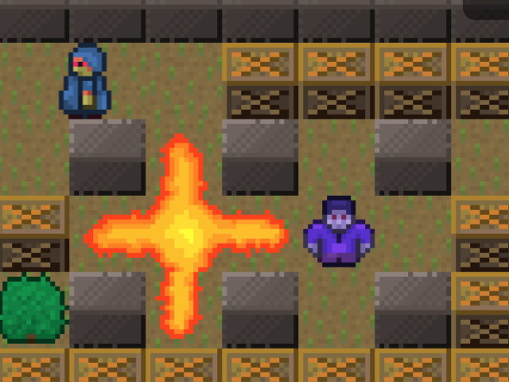

BoomBoom
========

This is a sample game for the [HappyFunTimes party games system](http://greggman.github.io/HappyFunTimes).

It's an arena bombing game. One thing it shows over other games is round based control. Players
joining the game have to wait for the current round to finish before they are added.

Cloning
-------

Prerequisites

*   node.js http://nodejs.org
*   bower http://bower.io
*   happyFunTimes http://superhappyfuntimes.net/install
*   hft-cli http://github.com/greggman/hft-cli

If you clone this you'll need follow the following steps

1.  install happyFunTimes http://superhappyfuntimes.net/install
2.  install node.js http://nodejs.org/download/
3.  install hft-cli by typing `sudo npm install -g hft-cli`
4.  install bower by typing `sudo npm install -g bower`
5.  clone this repo
6.  After cloning cd to the folder you just cloned into and type `bower install`
7.  edit `package.json` and change the `gameId` to some other id.
8.  type `hft add` which will add this to happyFunTimes.

